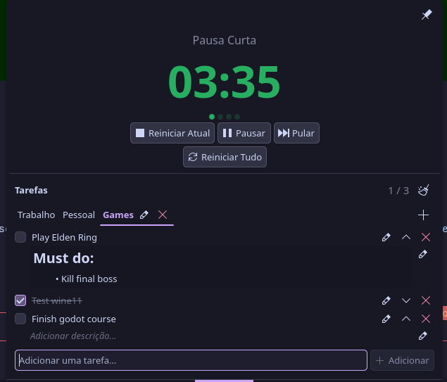

# Pomodoro Todo — KDE Plasma Widget



A KDE Plasma 6 panel widget that combines a **Pomodoro timer** with a **todo list** — everything you need to stay focused, right in your taskbar.

---

## Features

**Pomodoro Timer**
- Focus sessions (default 25 min) → Short breaks (5 min) → Long break after every 4 sessions (15 min)
- Session dots showing progress through a Pomodoro cycle
- Start / Pause / Reset Current / Reset All / Skip controls
- Timer countdown shown directly in the panel bar while running
- Desktop notifications when each session ends (toggleable)

**Todo List**
- Add and remove tasks
- Check off completed tasks (shown as strikethrough)
- Expand any task to add a description with full **Markdown support** (bold, lists, links, inline images)
- Edit task titles inline with a pencil button
- Clear completed tasks with one click (confirmation required)
- Tasks persist across sessions (saved in widget config)

**Workspaces**
- Organize tasks into multiple independent lists — e.g. *Work*, *Personal*, *Games*
- Switch between workspaces with a tab bar inside the popup
- Add new workspaces with the **+** button; rename with the pencil icon; delete with the trash icon (confirmation required, only shown when more than one workspace exists)
- A *Default* workspace is created automatically on first launch
- Existing tasks are migrated automatically when upgrading from an older version

**Google Tasks Sync** *(optional)*
- Bidirectional sync with Google Tasks
- Assign each workspace to a Google Task list
- Auto-sync on save and/or on a timer
- Last-write-wins conflict resolution
- Credentials stored securely in KWallet

**Fully Configurable**
- Focus and break durations
- Auto-start next session when a timer ends
- Active color (focus) and break color
- 4 separate tray icons: Focus / Paused+Idle / Short Break / Long Break
- Panel display mode: icon + timer, icon only, or timer only
- Notifications on/off
- Auto-expand new tasks and jump straight to the description field

**Localization**
- English (default)
- Portuguese — Brazil (pt_BR)
- Simplified Chinese (zh_CN)
- Falls back to English automatically

---

## Requirements

- KDE Plasma 6
- `gettext` (for compiling translations): `sudo pacman -S gettext`
- `python3` (for Google Tasks OAuth): pre-installed on most distros
- KWallet (for secure credential storage): included in KDE Plasma

---

## Installation

```bash
git clone https://github.com/otavioschwanck/pomodoro-todo-plasma
cd pomodoro-todo-plasma
./install.sh
```

Then restart Plasma:

```bash
kquitapp6 plasmashell && kstart plasmashell
```

Finally, right-click the panel → **Add Widgets** → search for **Pomodoro Todo**.

---

## Google Tasks Setup

1. Go to [Google Cloud Console](https://console.cloud.google.com/apis/credentials) and create or select a project
2. Navigate to **APIs & Services → Library**, search for **Tasks API**, and click **Enable**
3. Go to **APIs & Services → Credentials → Create Credentials → OAuth Client ID**
4. Choose **Desktop app** as the application type
5. Copy the **Client ID** and **Client Secret**
6. In the widget, open **Right-click → Configure… → Google Tasks**
7. Paste the Client ID and Client Secret, then click **Connect Google Account**
8. Complete the authorization in the browser that opens
9. Assign each workspace to a Google Task list using the **Choose…** buttons

---

## Usage

- **Left-click** the tray icon to open/close the popup
- **Middle-click** the tray icon to toggle Start/Pause without opening the popup
- **Right-click** the tray icon for quick actions (Start, Pause, Reset, Skip, Clear Completed Tasks)
- Click the **pin** button (top-right of the popup) to keep the popup open above other windows
- In the popup, press **Enter** or click **Add** to create a task
- Click a task title to expand/collapse its description
- Click the **pencil** icon to edit a task's title; click it again (or press Enter) to save
- In the description area, click the **pencil** icon to switch to edit mode — Markdown is rendered in read mode
- Use the **workspace tabs** to switch lists; click **+** to add a new workspace
- Go to **Right-click → Configure…** to adjust durations, colors, icons, and behavior

---

## File Structure

```
pomodoro-todo/
├── metadata.json               # Widget metadata (id, author, license)
├── screenshot.png              # Cover image
├── install.sh                  # Build + install script
├── contents/
│   ├── bin/
│   │   ├── wallet-helper.sh    # KWallet D-Bus bridge (read/write/clear secrets)
│   │   └── google-auth.py      # OAuth2 PKCE browser flow for Google Tasks
│   ├── config/
│   │   ├── main.xml            # KConfigXT schema (all settings)
│   │   └── config.qml          # Config dialog page list
│   ├── locale/
│   │   ├── pt_BR/LC_MESSAGES/  # Brazilian Portuguese .po/.mo
│   │   └── zh_CN/LC_MESSAGES/  # Simplified Chinese .po/.mo
│   └── ui/
│       ├── main.qml            # Root PlasmoidItem — all state + layout
│       ├── TodoItem.qml        # Single task row delegate (Markdown descriptions)
│       ├── WalletHelper.qml    # QML wrapper around wallet-helper.sh
│       ├── GoogleTasksSync.qml # Google Tasks bidirectional sync engine
│       ├── ConfigTimer.qml     # Timer settings page
│       └── ConfigGoogle.qml    # Google Tasks settings page
```

---

## License

GPL-2.0-or-later. Free to use, fork and modify.

---

## Author

**Otávio Schwanck dos Santos** — [otavioschwanck@gmail.com](mailto:otavioschwanck@gmail.com)
